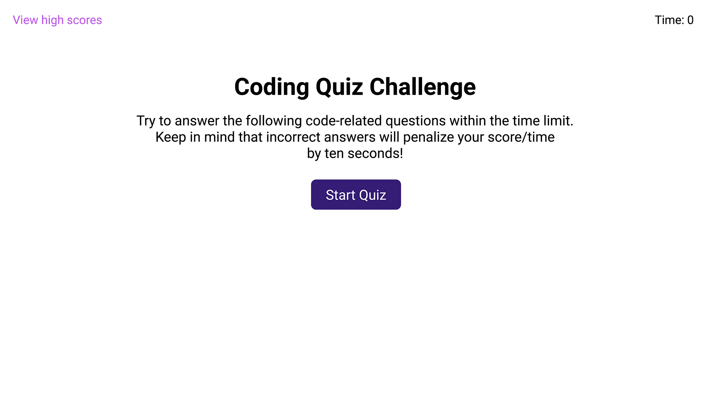

# Coding-quiz

Creating a timed, multiple-choice coding quiz that can keep track of high scores and quiz-takers' initials

## Discription

This app will run in the browser, and will feature dynamically updated HTML and CSS powered by JavaScript code. The app will have a clean and polished user interface that is responsive, ensuring that it adapts to multiple screen sizes. 

The application can:

- Display a button used to start the quiz at the first view

- Present a series of questions when clicking the "Start Quiz" button 
    
- Start a countdown timer once the quiz begins

- Subtract additional time (i.e., 10 seconds) from the timer if a question is answered incorrectly

- End the game when all questions have been answered or the timer reaches zero

- Save quiz-takers' initials and scores to a highscores view using local storage after the game ends

## Installation
The app can be installed follwing the link to the application page:
https://dr-jingyuezhao.github.io/Coding-quiz/

## Usage 

When opening the app in the browser, the user will be presented with a start screen with quiz rules. Once the "Start Quiz" button is clicked, a countdown timer starts and the quiz taker is presented with a multiple-choice question. When clicking one choice, the quiz taker will hear a sound indicating if the answer is correct or incorrect. Incorrect answers will penalize the quiz time by subtracting time (i.e., 10 seconds) from the clock. After answering a question, another question will be displayed. When all questions are answered or the timer reaches zero, the game is over. Then the quiz taker can save their initials and score by clicking the "Submit" button. All the saved high scores can be  viewed on another page. When clicking "Go Back", the quiz taker can start another game. When clicking "Clear Highscores", all the saved scores will be removed. The quiz taker can also view the stored highscores by pressing "View Highscores".

**Website demo**

The following image shows the web application's appearance and functionality:

## Credits

Resources:
* https://www.interviewbit.com/javascript-mcq/
* https://www.w3schools.com/jsref/obj_window.asp
* https://www.w3schools.com/js/js_htmldom_eventlistener.asp
* https://www.w3schools.com/jsref/met_win_setinterval.asp
* https://www.w3schools.com/jsref/met_document_createelement.asp
* https://www.w3schools.com/jsref/met_node_appendchild.asp
* https://www.w3schools.com/tags/att_data-.asp
* https://www.w3schools.com/jsref/prop_text_value.asp
* https://www.w3schools.com/tags/ref_av_dom.asp

## License

MIT License

Copyright (c) 2023 Jasmine

Permission is hereby granted, free of charge, to any person obtaining a copy
of this software and associated documentation files (the "Software"), to deal
in the Software without restriction, including without limitation the rights
to use, copy, modify, merge, publish, distribute, sublicense, and/or sell
copies of the Software, and to permit persons to whom the Software is
furnished to do so, subject to the following conditions:

The above copyright notice and this permission notice shall be included in all
copies or substantial portions of the Software.

THE SOFTWARE IS PROVIDED "AS IS", WITHOUT WARRANTY OF ANY KIND, EXPRESS OR
IMPLIED, INCLUDING BUT NOT LIMITED TO THE WARRANTIES OF MERCHANTABILITY,
FITNESS FOR A PARTICULAR PURPOSE AND NONINFRINGEMENT. IN NO EVENT SHALL THE
AUTHORS OR COPYRIGHT HOLDERS BE LIABLE FOR ANY CLAIM, DAMAGES OR OTHER
LIABILITY, WHETHER IN AN ACTION OF CONTRACT, TORT OR OTHERWISE, ARISING FROM,
OUT OF OR IN CONNECTION WITH THE SOFTWARE OR THE USE OR OTHER DEALINGS IN THE
SOFTWARE.